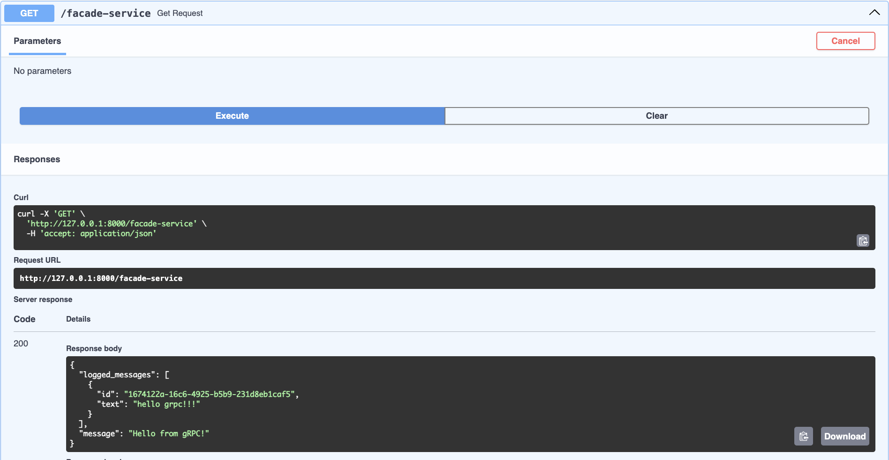
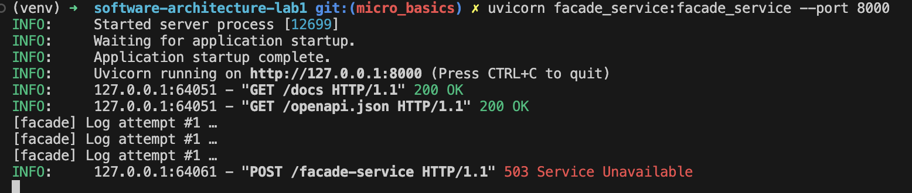
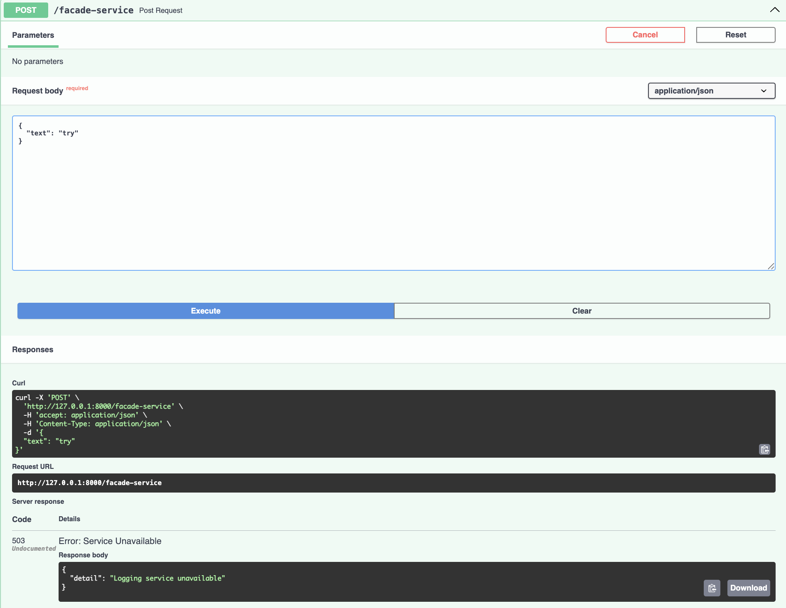
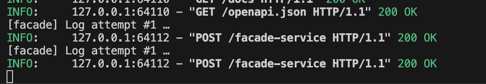
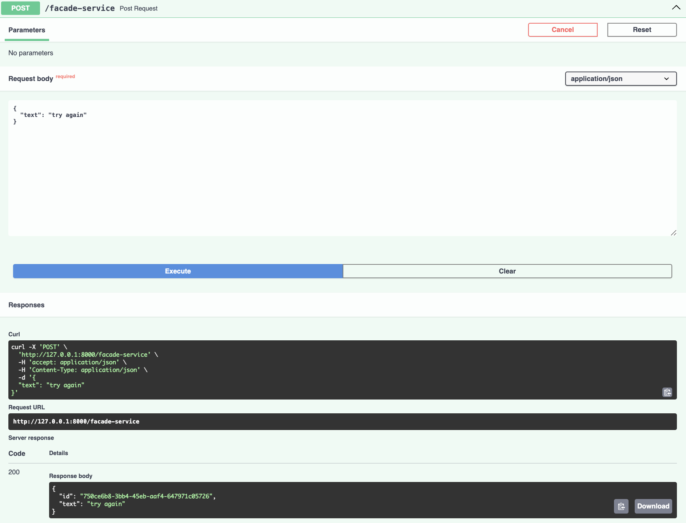

# software-architecture-lab1

### Install dependencies
```bash
python3 -m pip install -r requirements.txt
```

### Run python file
```bash
python3 runner.py
```

### Implementation

**Method**: GET<br>
**Service**: facade<br>
**Url**: http://0.0.0.0:8000/facade-service <br>


<br>

**Method**: POST<br>
**Service**: facade<br>
**Url**: http://0.0.0.0:8000/facade-service <br>


<br>

**Method**: GET<br>
**Service**: logging<br>
**Url**: http://0.0.0.0:8001/logging-service<br>

After adding one more message:


<br>

**Method**: POST<br>
**Service**: logging<br>
**Url**: http://0.0.0.0:8001/logging-service<br>
**Console output:**


<br>


# Additional tasks

First of all run sepparately all services

```bash
python3 logging_service.py    # listens on 8001
python3 messages_service.py   # listens on 8002
uvicorn facade_service:facade_service --port 8000
```


Let's make post request using `grpc`


Let's make get request


Let's try to implement retry mechanism. Here I disconnected logging service. We can see there are three attempts:



Now let's reconnect logging service:

