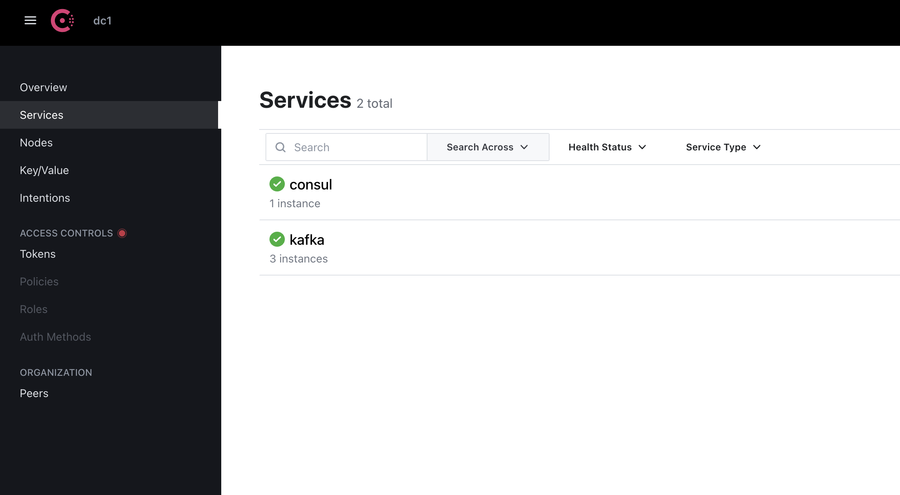
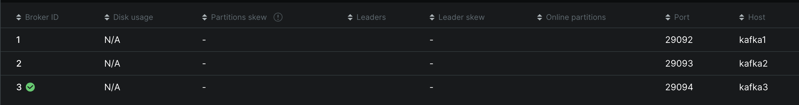
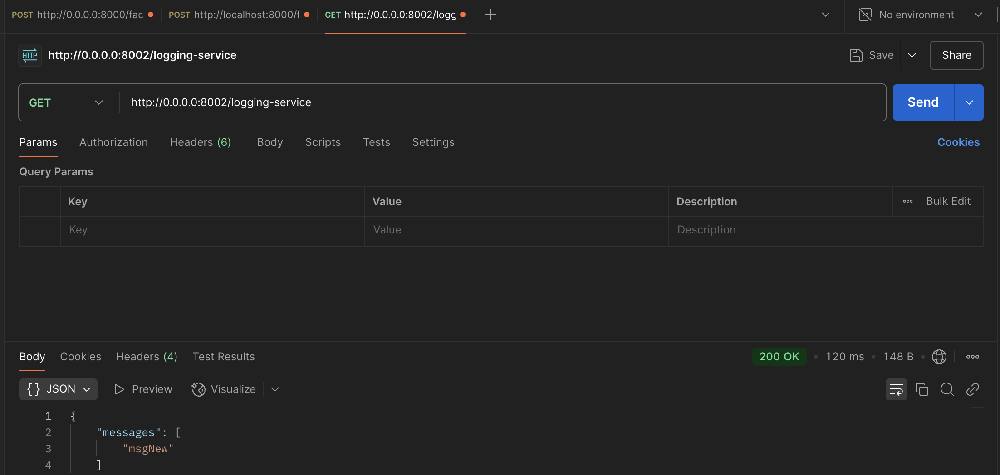
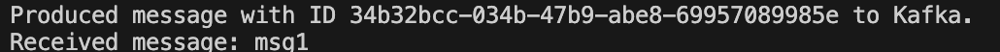
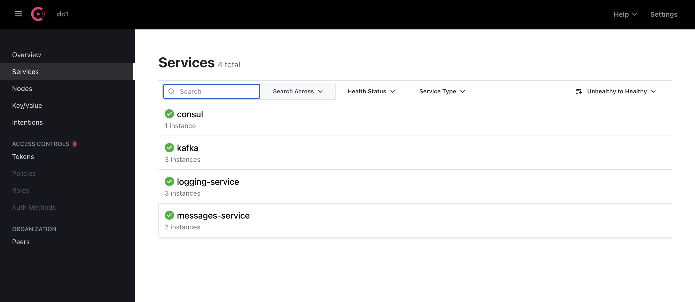
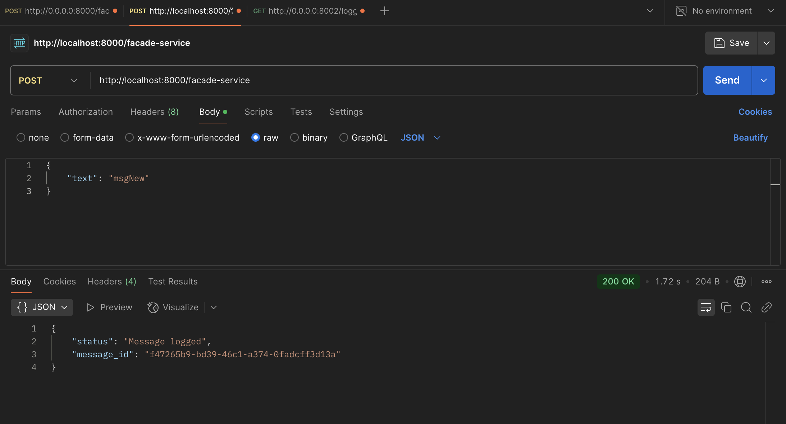
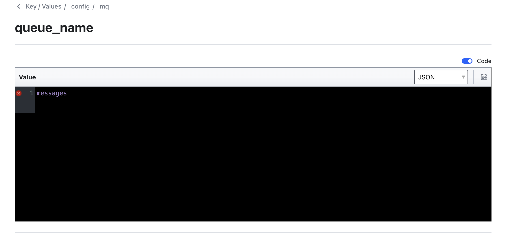

# software-architecture-lab5

This project demonstrates a fault‑tolerant messaging system using Docker Compose and Kafka brokers.

## Prerequisites

- Docker  
- Docker Compose  
- `curl`  

## 1. Start all services

```bash
docker-compose up -d
```

Verify that the containers are up and running:

```bash
docker ps
```



You should see three Kafka broker containers:




## 2. Post messages

### 2.1 Post a single message

```bash
curl -X POST http://127.0.0.1:8000/facade-service \
     -H "Content-Type: application/json" \
     -d '{"text": "msg1"}'
```




### 2.2 Post multiple messages in a loop(optional)

```bash
for i in {1..10}; do
  curl -X POST http://127.0.0.1:8000/facade-service \
       -H "Content-Type: application/json" \
       -d "{\"text\": \"msg$i\"}"
done
```

I did it one by one using code from 2.1


## 3. Retrieve messages

```bash
curl -X GET http://127.0.0.1:8000/facade-service
```



## 4. Simulate broker failure

Kill one of the Kafka brokers:

```bash
docker kill <broker_container_id>
```



Re-run the GET to confirm the system is still operational:

```bash
curl -X GET http://127.0.0.1:8000/facade-service
```

