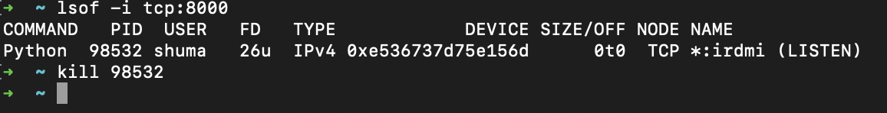

## Fault‑Tolerant Messaging System with Consul Service Discovery & Config Server

This project demonstrates a fault‑tolerant messaging architecture using Consul for service discovery, configuration management, and health checks, alongside Kafka, Hazelcast, and HTTP microservices.

---

### Table of Contents

1. [Prerequisites](#prerequisites)
2. [Quick Start](#quick-start)
3. [Consul Key‑Value Setup](#consul-key-value-setup)
4. [Running the Microservices](#running-the-microservices)
5. [Usage Examples](#usage-examples)
6. [Observing Service Discovery](#observing-service-discovery)
7. [Clean Up](#clean-up)
8. [Troubleshooting](#troubleshooting)

---

## Prerequisites

- **Docker** (v20+) & **Docker Compose**
- **Python 3.9+** with dependencies installed (`pip install -r requirements.txt`)
- **curl** (for loading KV data)

---

## Quick Start

1. **Launch the platform**
   ```bash
   docker-compose up -d
   ```
2. **Verify containers**
   ```bash
   docker ps
   ```
   

3. **Populate Consul KV**
   ```bash
   ./consul_kv.sh
   ```
   We need to populate Consul's key-value store with config data used by our app to dynamically discover and configure services.
4. **Start microservices**
   ```bash
   python3 runner.py
   ```

---

## Consul Key‑Value Setup

The `consul_kv.sh` script executes the following `curl` commands to set configuration keys:

```bash
curl -X PUT http://localhost:8500/v1/kv/config/kafka/bootstrap \
     --data-binary 'localhost:29092,localhost:29093,localhost:29094'

curl -X PUT http://localhost:8500/v1/kv/config/mq/queue_name \
     --data-binary 'messages'

curl -X PUT http://localhost:8500/v1/kv/config/hazelcast/members \
     --data-binary '127.0.0.1:5701,127.0.0.1:5702,127.0.0.1:5703'

curl -X PUT http://localhost:8500/v1/kv/config/hazelcast/cluster \
     --data-binary 'dev'
```  

Inspect loaded KV:
```bash
curl http://localhost:8500/v1/kv/config?recurse
```  


---

## Running the Microservices

The `runner.py` script spins up each FastAPI-based service in its own process:
- **Facade Service** (port 8000)
- **Messages Service** (ports 8001 & 8005)
- **Logging Service** (ports 8002, 8003 & 8004)

```bash
python3 runner.py
```  


Each service on startup:
1. Registers itself with Consul
2. Reads its configuration keys (Kafka bootstrap, MQ queue, Hazelcast)
3. Begins serving HTTP or Kafka/Hazelcast endpoints

---

## Usage Examples

### POST /facade-service

Submit a message for logging and enqueue:

```bash
curl -X POST http://localhost:8000/facade-service \
     -H 'Content-Type: application/json' \
     -d '{"text":"msgNew"}'
```
Or do it using Postman
 

### GET /logging-service

Retrieve combined logs and messages:

```bash
curl http://localhost:8000/logging-service
```

 


---

## Observing Service Discovery

1. **Consul UI** at [http://localhost:8500](http://localhost:8500)
2. See each service under **Services**, including multiple instances
3. Kill one instance (e.g. `kill <PID>`), refresh UI to confirm its status changes. As we can see it was sucessfully deregistered




---

## Clean Up

```bash
docker-compose down -v
pkill -f runner.py   # stop Python services
```

